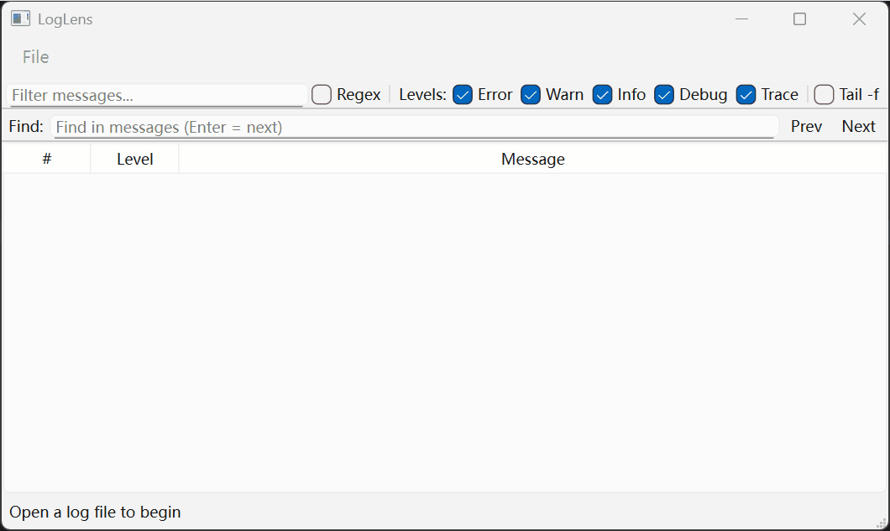
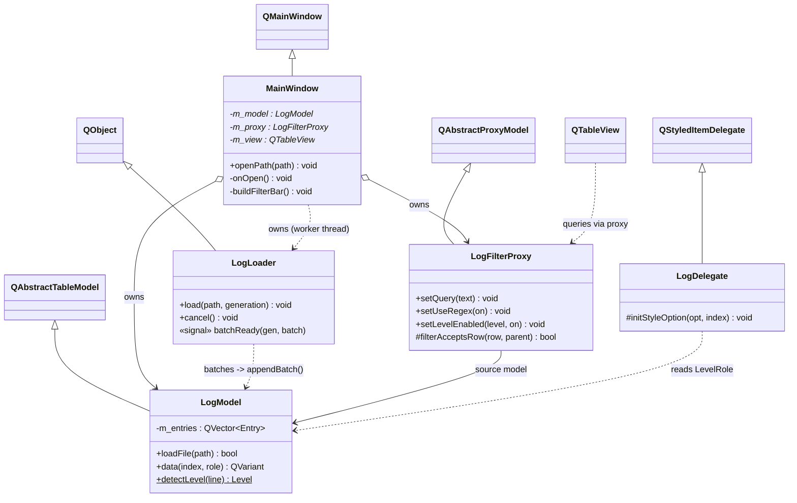
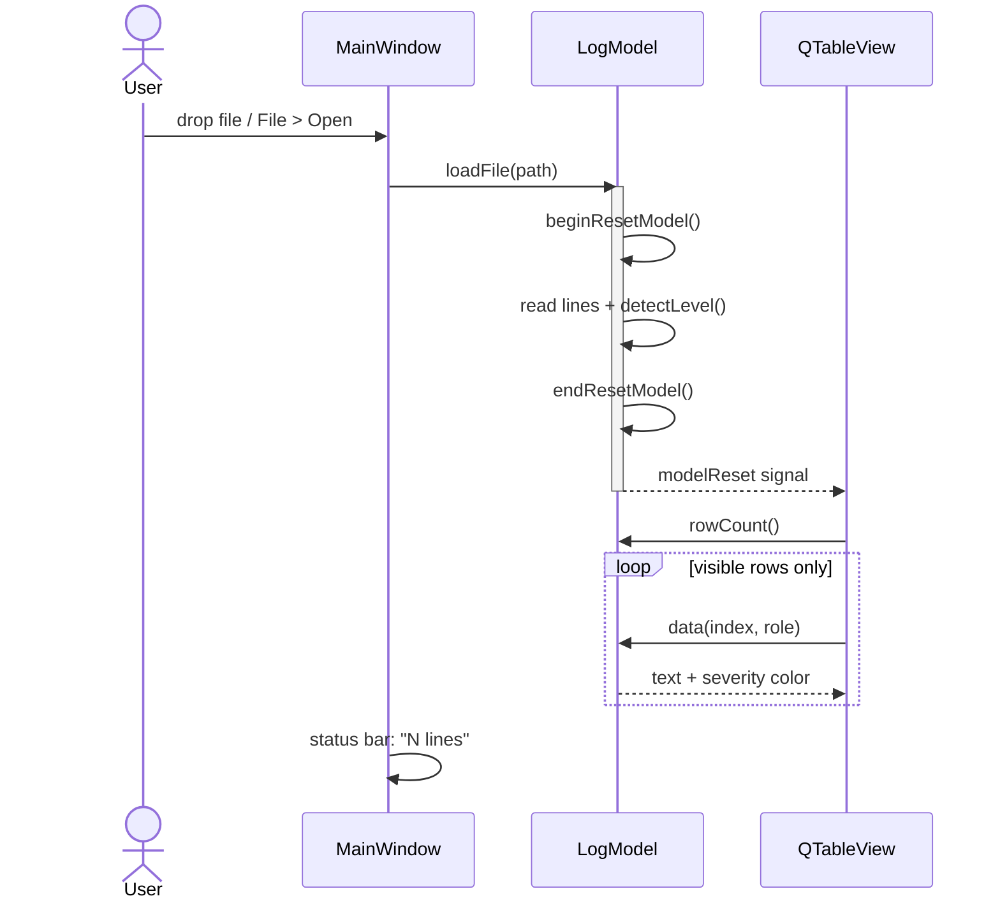
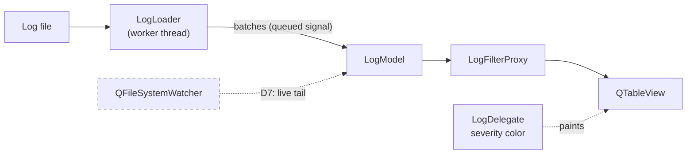

# LogLens

A fast **Qt desktop log viewer / analyzer** for large log files.

- Virtualized **Model/View** table (`QAbstractTableModel` + a custom proxy)
- Substring + **regex** filtering, per-severity row coloring
- **Background parsing** on a worker thread — the UI never freezes
- Live **tail -f** via `QFileSystemWatcher`
- **Find** (next/prev, wrapping) and **export** of the filtered view
- Window/session state persisted with `QSettings`

> Tech: C++17 · Qt 6 Widgets · CMake

<!-- Record with ScreenToGif: drag a large .log in (instant open) -> type a
     filter -> toggle regex -> show live tail. 5-12s, <5MB, ~800px wide.
     Uncomment once docs/demo.gif exists:

-->

## Prerequisites

A Qt 6 SDK (MSVC build). Fastest install without a Qt account, using
[aqtinstall](https://github.com/miurahr/aqtinstall):

```sh
pip install aqtinstall
# Installs Qt 6.8.1 for MSVC 2022 x64 into ./Qt
aqt install-qt windows desktop 6.8.1 win64_msvc2022_64 --outputdir C:/Qt
```

(Or use the official Qt Online Installer.)

## Build (Windows / MSVC)

```sh
cmake -S . -B build -G "Visual Studio 17 2022" -A x64 ^
      -DCMAKE_PREFIX_PATH=C:/Qt/6.8.1/msvc2022_64
cmake --build build --config Debug
./build/Debug/LogLens.exe            # or: LogLens.exe some.log
```

If Qt's DLLs aren't found at runtime, either add
`C:/Qt/6.8.1/msvc2022_64/bin` to `PATH` or run `windeployqt` on the exe.

## Architecture

LogLens follows Qt's **Model/View** separation: the window handles UI and
interaction, the model owns the data and decides how it is presented, and the
view renders only the rows currently visible (virtualized) so huge files stay
responsive.

### Classes



### Opening a file



### Data flow (current + planned)

New features slot in as a layer — the core `LogModel` barely changes.



`LogFilterProxy` (level + substring/regex filtering) and `LogDelegate` (coloring)
keep `LogModel` a pure data container. `LogLoader` parses on a worker thread and
streams batches back via a queued signal, so the UI stays responsive on huge
files. D7 (live tail) remains planned (dashed).

### Design note: safe threaded loading

Qt only lets the thread that created a model mutate it, so `LogLoader` parses on
the worker thread but the model is only ever touched on the UI thread — the
worker emits `batchReady` and a queued connection delivers it to
`LogModel::appendBatch`. Switching files mid-load is a classic race: the previous
load's in-flight batches may still be queued when the new one starts. Two
mechanisms handle it — `cancel()` (an atomic flag) stops the worker promptly, and
a monotonic **generation** token tags every signal so any late batch from an old
load is recognized and dropped instead of corrupting the new file's view.

### Design note: why a custom proxy instead of `QSortFilterProxyModel`

The obvious choice for filtering is `QSortFilterProxyModel`, and that's what the
first cut used. It froze the UI: on a 500k-line log, unchecking a severity hides
tens of thousands of *scattered* rows, and the proxy filters **incrementally** —
emitting a `rowsRemoved` range per contiguous block. The view then processes tens
of thousands of removal signals on the UI thread, which reads as a hang.

`LogFilterProxy` subclasses `QAbstractProxyModel` instead and filters by
**rebuild-and-reset**: one O(N) scan builds a compact `visible source rows`
vector, published with a single `beginResetModel`/`endResetModel`. One signal,
not thousands. A parallel `source→proxy` vector keeps selection and
`dataChanged` mapping O(1). Text filtering is debounced (150 ms) so typing never
triggers a per-keystroke rescan.
