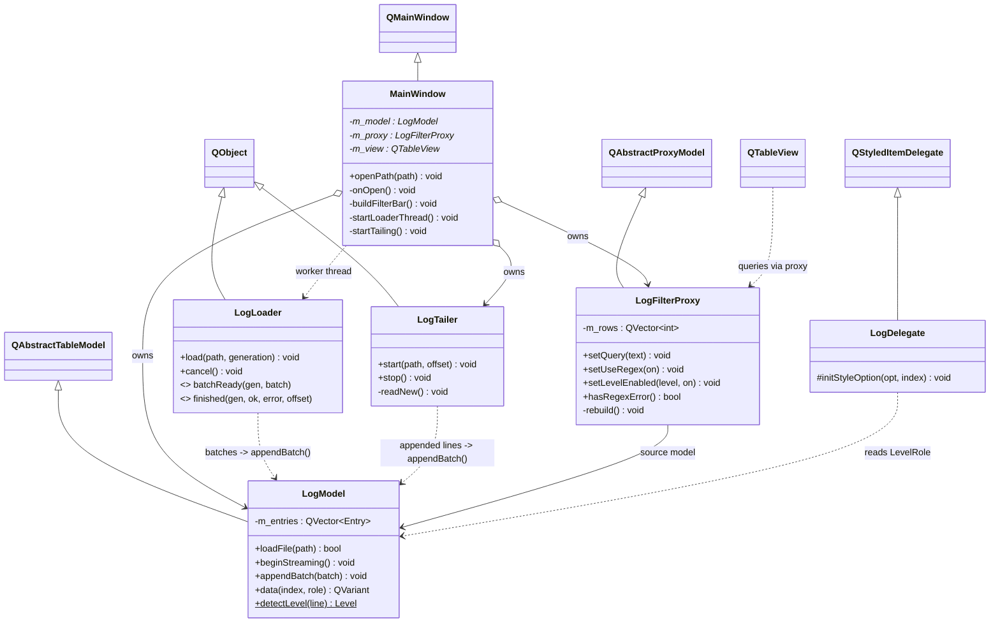
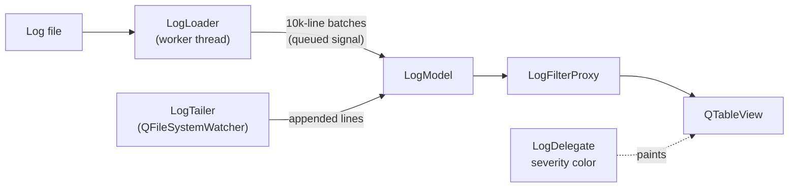

# LogLens

A fast **Qt desktop log viewer / analyzer** for large log files.

- Virtualized **Model/View** table (`QAbstractTableModel` + a custom proxy)
- Substring and **regex** filtering, with per-severity row coloring
- **Background parsing** on a worker thread, so the UI stays responsive
- Live **tail -f** via `QFileSystemWatcher`
- **Find** next/previous with wrapping
- Export of the currently filtered view
- Window/session state persisted with `QSettings`

> Tech: C++17 | Qt 6 Widgets | CMake


## Prerequisites

A Qt 6 SDK (MSVC build). Fastest install without a Qt account, using
[aqtinstall](https://github.com/miurahr/aqtinstall):

```sh
pip install aqtinstall
# Installs Qt 6.8.1 for MSVC 2022 x64 into C:/Qt
aqt install-qt windows desktop 6.8.1 win64_msvc2022_64 --outputdir C:/Qt
```

Or use the official Qt Online Installer.

## Build (Windows / MSVC)

```sh
cmake -S . -B build -G "Visual Studio 17 2022" -A x64 ^
      -DCMAKE_PREFIX_PATH=C:/Qt/6.8.1/msvc2022_64
cmake --build build --config Debug
./build/Debug/LogLens.exe            # or: LogLens.exe some.log
```

If Qt's DLLs are not found at runtime, either add
`C:/Qt/6.8.1/msvc2022_64/bin` to `PATH` or run `windeployqt` on the executable.

## Features

- Open logs from File > Open, drag and drop, or a command-line path.
- Stream large files into the table in 10k-line batches from a worker thread.
- Filter by message text, regex, and severity.
- Show invalid regex errors in the status bar.
- Find next/previous within the filtered rows.
- Export the filtered rows to a `.log` or `.txt` file.
- Follow appended lines with Tail -f while preserving blank lines.
- Resume tailing from the loader's final byte offset to avoid missing writes
  that happen between initial load completion and watcher setup.

## Architecture

LogLens follows Qt's **Model/View** separation: the window handles UI and
interaction, the model owns parsed log entries, the proxy owns filtering, and
the view renders only the rows currently visible. This keeps huge files
responsive while avoiding UI-thread work that scales with every hidden row.

### Classes



### Data Flow



`LogLoader` parses the initial file on a worker thread and emits batches back to
the UI thread. The model is only mutated on the UI thread. `LogTailer` watches
the same file after the initial load and appends complete new lines from the
last byte offset reported by the loader.

## Design Notes

### Safe Threaded Loading

Qt models must be mutated from the thread that owns them. `LogLoader` therefore
parses in a worker thread but never touches `LogModel` directly. It emits
`batchReady`, and a queued connection delivers the batch to
`LogModel::appendBatch` on the UI thread.

Switching files mid-load is handled with two mechanisms: `cancel()` asks the
worker to stop promptly, and a monotonic generation token tags every loader
signal. Late batches from older generations are ignored.

### Tailing Without Losing Appends

When the initial load finishes, `LogLoader::finished` reports the final byte
offset it reached. Tail -f starts from that exact offset rather than from the
current file size. This avoids losing lines appended after the loader reached
EOF but before the file watcher was armed.

`LogTailer` reads only complete lines and leaves a half-written final line for a
future file-change notification. Blank lines are preserved.

### Custom Proxy Instead of QSortFilterProxyModel

The first implementation used `QSortFilterProxyModel`. On a 500k-line log,
unchecking a severity could hide tens of thousands of scattered rows, causing
the proxy to emit many `rowsRemoved` ranges and making the UI appear frozen.

`LogFilterProxy` instead rebuilds a compact "visible source rows" vector and
publishes it with a single `beginResetModel` / `endResetModel` pair. Filtering is
still O(N), but the view receives one reset instead of a storm of row removal
signals. A parallel `source -> proxy` vector keeps index mapping O(1). Text
filtering is debounced by 150 ms so typing does not trigger a rescan per
keystroke.

## Known Limitations

- Logs are currently decoded as UTF-8.
- Tail -f handles appended lines and truncation defensively, but full log
  rotation behavior can still be improved.
- Filtering scans all loaded rows; additional indexing or cached lowercase text
  could improve very large repeated searches.
